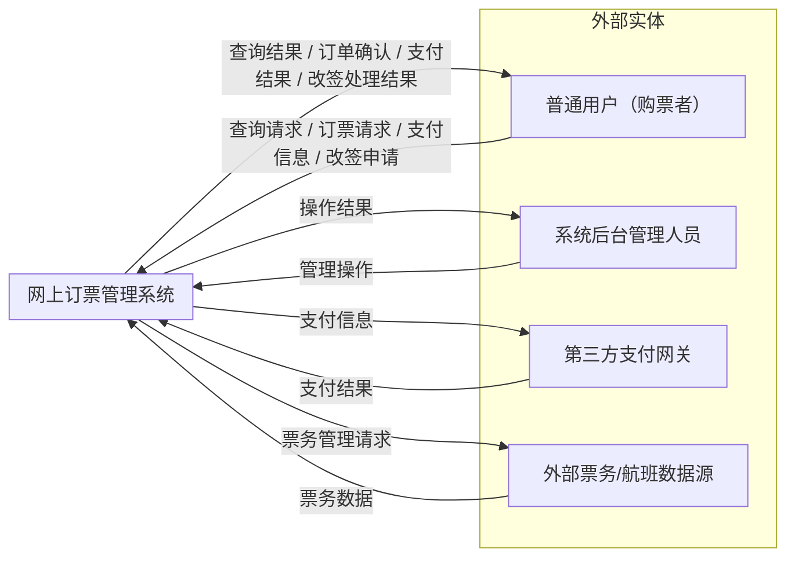
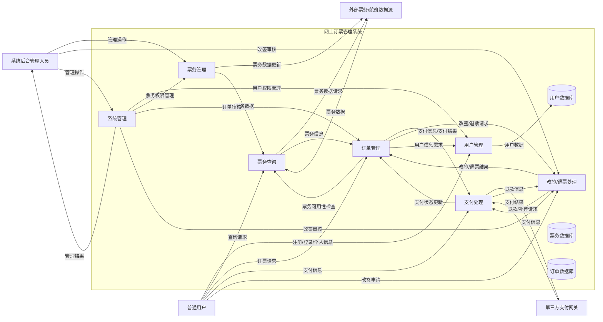
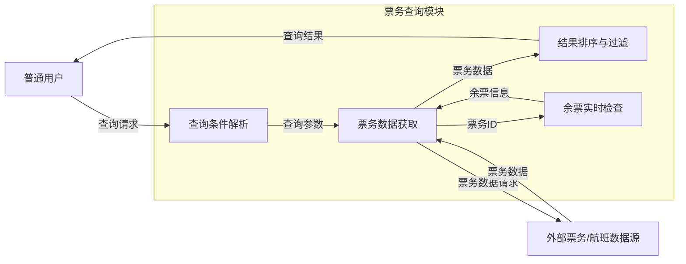
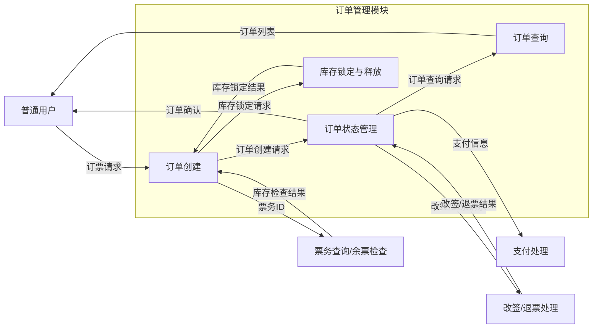
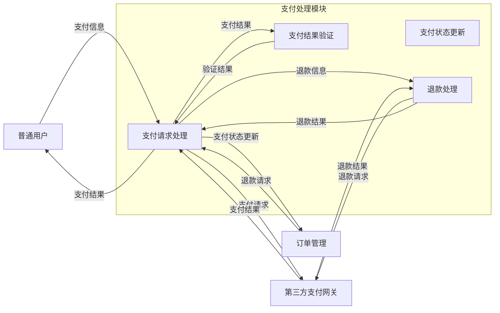
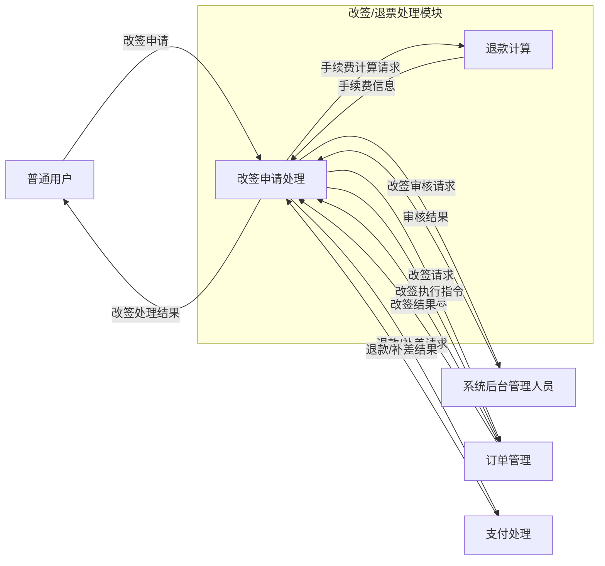

```mermaid
flowchart LR
  subgraph 外部实体
    U[普通用户（购票者）]
    A[系统后台管理人员]
    P[第三方支付网关]
    E[外部票务/航班数据源]
  end

  subgraph 系统["网上订票管理系统"]
  end

  U -->|查询请求 / 订票请求 / 支付信息 / 改签申请| 系统
  系统 -->|查询结果 / 订单确认 / 支付结果 / 改签处理结果| U

  A -->|管理操作| 系统
  系统 -->|操作结果| A

  E -->|票务数据| 系统
  系统 -->|票务管理请求| E

  P -->|支付结果| 系统
  系统 -->|支付信息| P
```

```mermaid
flowchart LR
  U[普通用户]
  A[系统后台管理人员]
  P[第三方支付网关]
  E[外部票务/航班数据源]

  subgraph 系统["网上订票管理系统"]
    UM[用户管理]
    TQ[票务查询]
    OM[订单管理]
    TM[票务管理]
    PP[支付处理]
    CR[改签/退票处理]
    SM[系统管理]
    UD[(用户数据库)]
    TD[(票务数据库)]
    OD[(订单数据库)]
  end

  %% 用户管理
  U -->|注册/登录/个人信息| UM
  UM -->|用户数据| UD

  %% 票务查询
  U -->|查询请求| TQ
  TQ -->|票务数据请求| E
  E -->|票务数据| TQ
  TQ -->|票务信息| OM

  %% 订单管理
  U -->|订票请求| OM
  OM -->|支付信息/支付结果| PP
  OM -->|改签/退票请求| CR
  OM -->|用户信息需求| UM
  OM -->|票务可用性检查| TQ

  %% 票务管理
  A -->|管理操作| TM
  TM -->|票务数据更新| E
  TM -->|票务数据| TQ

  %% 支付处理
  U -->|支付信息| PP
  PP -->|支付信息| P
  P -->|支付结果| PP
  PP -->|退款信息| CR
  PP -->|支付状态更新| OM

  %% 改签/退票
  U -->|改签申请| CR
  A -->|改签审核| CR
  CR -->|改签/退票结果| OM
  CR -->|退款/补差请求| PP

  %% 系统管理
  A -->|管理操作| SM
  SM -->|管理结果| A
  SM -->|用户权限管理| UM
  SM -->|票务权限管理| TM
  SM -->|订单审核| OM
  SM -->|改签审核| CR

```

```mermaid
flowchart LR
  U[普通用户]
  E[外部票务/航班数据源]

  subgraph 票务查询模块
    QC[查询条件解析]
    GF[票务数据获取]
    RF[结果排序与过滤]
    RS[余票实时检查]
  end

  U -->|查询请求 | QC
  QC -->|查询参数| GF
  GF -->|票务数据请求| E
  E -->|票务数据| GF
  GF -->|票务数据| RF
  RF -->|查询结果| U

  GF -->|票务ID| RS
  RS -->|余票信息| GF

```

```mermaid
flowchart LR
  U[普通用户]
  TQ[票务查询/余票检查]
  PP[支付处理]
  CR[改签/退票处理]

  subgraph 订单管理模块
    OC[订单创建]
    OS[订单状态管理]
    OQ[订单查询]
    SL[库存锁定与释放]
  end

  U -->|订票请求| OC
  OC -->|票务ID| TQ
  TQ -->|库存检查结果| OC

  OC -->|库存锁定请求| SL
  SL -->|库存锁定结果| OC

  OC -->|订单创建请求| OS
  OS -->|订单确认 | U

  OS -->|支付信息 | PP
  OS -->|改签/退票请求| CR

  CR -->|改签/退票结果| OS

  OS -->|订单查询请求| OQ
  OQ -->|订单列表| U

```

```mermaid
flowchart LR
  U[普通用户]
  P[第三方支付网关]
  OM[订单管理]

  subgraph 支付处理模块
    PR[支付请求处理]
    PV[支付结果验证]
    PS[支付状态更新]
    RF[退款处理]
  end

  U -->|支付信息 | PR
  PR -->|支付请求| P
  P -->|支付结果| PR

  PR -->|支付结果| PV
  PV -->|验证结果| PR

  PR -->|支付状态更新| OM
  OM -->|退款请求| PR

  PR -->|退款信息| RF
  RF -->|退款请求| P
  P -->|退款结果| RF
  RF -->|退款结果| PR

  PR -->|支付结果| U

```

```mermaid
flowchart LR
  U[普通用户]
  A[系统后台管理人员]
  OM[订单管理]
  PP[支付处理]

  subgraph 改签/退票处理模块
    CA[改签申请处理]
    RC[退款计算]
  end

  U -->|改签申请 | CA
  CA -->|改签请求| OM
  OM -->|订单信息| CA

  CA -->|手续费计算请求| RC
  RC -->|手续费信息| CA

  CA -->|改签审核请求| A
  A -->|审核结果| CA

  CA -->|改签执行指令| OM
  OM -->|改签结果| CA

  CA -->|退款/补差请求| PP
  PP -->|退款/补差结果| CA

  CA -->|改签处理结果| U

```

